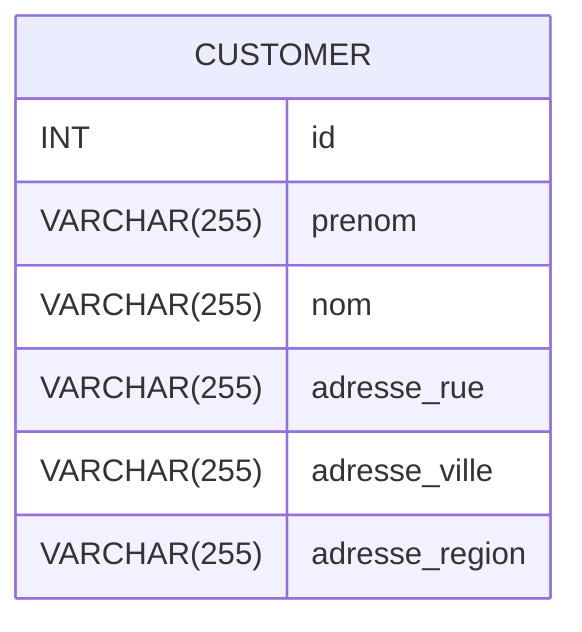
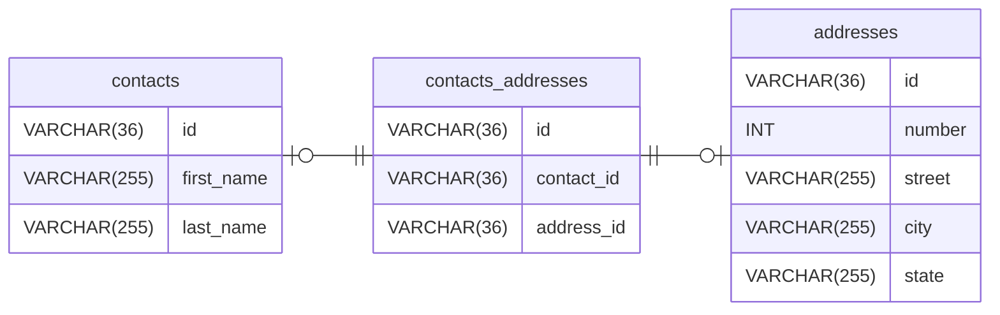
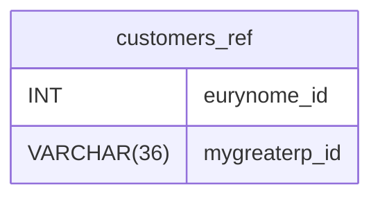
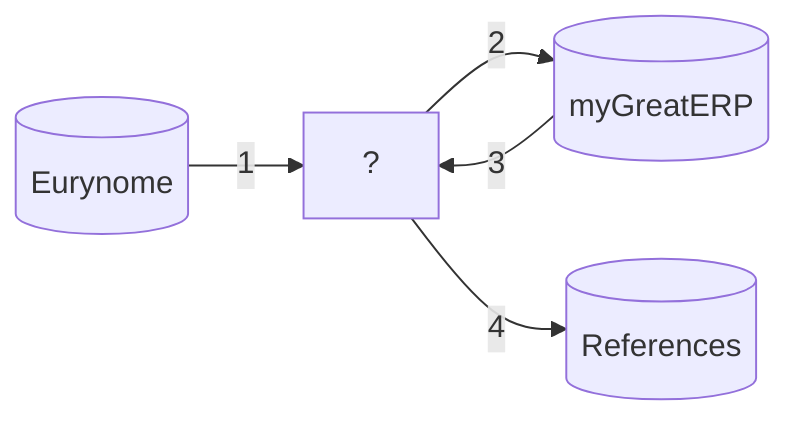

# Instructions

## Préambule
En absence de cluster Kafka disponible à l'UL, il nous faudra utiliser le même environnement Cloud fourni par Red Hat.

## Problématique
Votre Entreprise, spécialisée dans le commerce de produits phyto-sanitaires, a décidé de moderniser son système d’information. Celui-ci est actuellement composé d’une brique principale sous forme d’un logiciel ERP vieillissant appelé « Eurynomé ».

Cette solution développée « in-house » n’est plus maintenue depuis des années car plus personne ne sait vraiment comment elle fonctionne. Qui plus est le langage utilisé pour la coder est tellement spécifique que plus personne ne le comprend. Pour empirer la situation, le logiciel n’est pas interfaçable avec des Web Services (ni REST, ni SOAP). Ce logiciel bloque donc l’Entreprise dans sa nécessaire évolution et l’empêche de lutter contre la concurrence efficacement.

Pour résoudre ce problème, l’Entreprise a décidé de mettre en place une nouvelle solution plus moderne. Elle est nommé myGreatERP. Pour des questions de risques, il est impossible d’envisager une migration « big-bang » dans laquelle l’ancien système est remplacé en une seule fois par le nouveau.

Il va donc falloir procéder par étape et décommissionner progressivement le logiciel actuel au fur et à mesure que les fonctionnalités sont déployées dans son remplaçant.

Le premier module prévu pour être migrer est le module CRM. En effet le service Maketing de l’Entreprise attend avec impatience de pouvoir lancer des campagnes emails pour capturer de nouveaux leads.

Le logiciel « legacy » repose massivement sur les technologies de la base de données MySQL. Celle-ci est accessible à l’URL suivante : eurynome-db:3306/eurynome.

Il s’agit bien sûr d’une copie partielle et anonymisée de la base de production afin de pouvoir travailler sans risque pour les données.

La seule table mise à disposition pour le moment est la table clients dont le schéma est le suivant :



Le nouveau logiciel, beaucoup plus moderne, repose lui aussi sur une base de données MySQL : mygreaterp-db:3306/mygreaterp

Sa structure de données (les tables sont vides) est définie ci-dessous. A noter que tous les identifiants sont de type UUID.



Le but de l’exercice noté est le suivant : nous voulons synchroniser la table des clients de l’ancien vers le nouveau système, en temps réel **tout en conservant le lien entre les clients des deux systèmes dans une base référentielle**, nommée "referential" installée sur le nouveau serveur MySQL.

La seule table référentielle requises est des plus basique :


> [!NOTE]
> Dans MySQL, « SELECT LAST_INSERT_ID() ; » peut être très utile.

Pour résumer, l'exercice consiste à réaliser le flux d'intégration suivant :

Ce qui vous est demandé est de définir et implémenter **tout** ce qui se trouve dans la boite [?]

## Nettoyer votre namespace
Depuis l'interface, via ligne de commande, il va d'abord nous falloir *tout* supprimer
- Helm --> Version
    - L'instance de Kafka
- Workloads/Charges de travail :
    - Depuis les Deployments :
        - la base de données MySQL
        - le client Kafka
        - Debezium
    - Depuis les DeploymentConfigs
        - la base de données MariaDB
    - Depuis les ConfigMaps :
        - client-properties
    - Depuis les Secrets :
        - mariadb*
- Mise en réseau --> Services
    - debezium
    - mariadb
    - mysql
- Storage/Stockage -> PersistentVolumeClaims
    - les 3 PVCs de Kakfa
    - celui de MariaDB

## Fork de ce repository dans votre compte GitHub
> [!CAUTION]
> Pensez à commiter et pousser votre code sur votre repository GitHub

## Déploimenet des pré-requis
1. Un cluster Kafka
```
helm repo add bitnami https://charts.bitnami.com/bitnami
helm install my-kafka bitnami/kafka --set image.repository=bitnamilegacy/kafka
```
2. La base de données source
```
cd eurynome
apply -f eurynome-db.yaml
oc rsync ./db eurynome-db-xxxxxxxxxx-yyyyyy:/tmp
oc rsh eurynome-db-xxxxxxxxxx-yyyyyy
cd /tmp
cat eurynome.sql | /usr/bin/mysql -uroot -peurynome
mysql -uroot -peurynome
grant all privileges on eurynome.* to 'eurynomeuser'@'%';
flush privileges;
exit
cd ..
```

2. La base de données destination
```
cd mygreaterp
apply -f mygreaterp-db.yaml
oc rsync ./db mygreaterp-db-xxxxxxxxxx-yyyyyy:/tmp
oc rsh mygreaterp-db-xxxxxxxxxx-yyyyyy
cd /tmp
cat init-mygreaterp.sql | /usr/bin/mysql -uroot -pmygreaterp
mysql -uroot -pmygreaterp
grant all privileges on mygreaterp.* to 'mygreaterpuser'@'%';
flush privileges;
cd ..
```

### Lancement d'un nouveau Workspace OpenShift Dev Spaces
Pointant cette fois-ci sur votre nouveau repository.

## Notes de conception

Déploiement d'un nouveau cluster kafka.

Creation d'un deploiement de debezium pour lire de manière continue les données.


Je vais me connecter à la base de données source, euronyme pour collecter ces données et les insérer dans la base de données destination en passant par un cluster kafka. Je vais déjà stocké les données de la base de données source.


Préparation de la base de donnée eurynome (source), j'ai ensuite mis en place debezium pour suivre les evnements das la base source.
Kafka va ensuite permettre la relation jusqu'à la base de donnée de destination (mygreaterp).

Code python permet de récupérer les données de les découper pour les mettre dans les 3 tables dans myGreatERP.